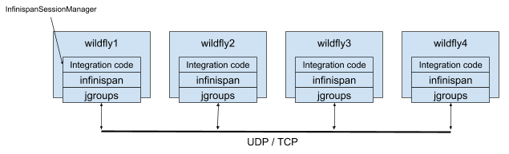

# WildFly Clustering Reproducers

This repo contains some recipes and scripts on how to easily and quickly setup some WildFly cluster.

## Overview

WildFly nodes running in cluster (started using standalone-ha.xml or standalone-full-ha.xml e.g. `WILDFLY_DIRECTORY/bin/standalone.sh --server-config=standalone-ha.xml`) can use a distributed cache and share data across nodes:

## Reproducers

### BASIC

Demonstrates how to run a 4 nodes WildFly cluster using an distributed cache for WARs;
a distributable WAR is deployed to the 4 nodes and some HTTP requests are fired at the 4 nodes to check the cache is working.

### HOTROD_JDG

Demonstrates how to run a 2 nodes WildFly cluster using an invalidation cache for webapps, backed by a 2 nodes Infinispan Server cluster.

> NOTE: Uses the __NEW__ WildFLy HotRod session manager to connect to the remote Infinispan Server cluster.

### METRICS

Demonstrates how to run a 4 nodes WildFly cluster producing metrics collected by Prometheus and visualized by Grafana.

### INVALIDATION_DB

Demonstrates how to run a 4 nodes WildFly cluster using an invalidation cache for webapps, backed by a relational Database.

### INVALIDATION_JDG

Demonstrates how to run a 2 nodes WildFly cluster using an invalidation cache for webapps, backed by a 2 nodes Infinispan Server cluster.

> NOTE: Uses the traditional WildFLy Infinispan session manager to connect to the remote Infinispan Server cluster.

### SHARED SESSIONS

Demonstrates how to run an EAR containing 2 WAR files sharing HTTP sessions, on a 4 nodes WildFly cluster;
Some HTTP requests are fired at the 4 nodes to check that session are shared across WAR files and nodes;

### SINGLETON DEPLOYMENT

Demonstrates how to run a Singleton Deployment WAR on a 4 nodes WildFly cluster;
a Singleton Deployment WAR is deployed to the 4 nodes and some HTTP requests are fired at the 4 nodes to check the service is active on just on node;

### SSO

Demonstrates using SSO with an application deployed on 2 nodes cluster

